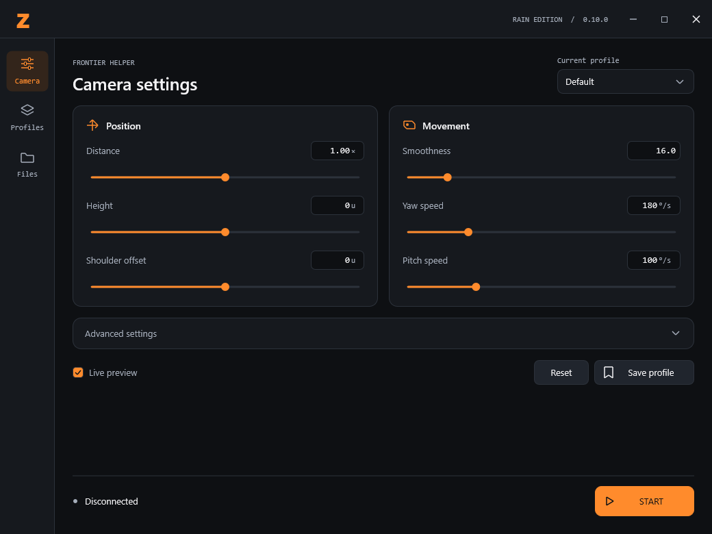

# Frontier Helper

Native camera helper for the supported Rain HD build of Monster Hunter Frontier.
Version **0.10.0** replaces the command-line screen with the Compact graphical
interface: black and orange, a bold Z, aligned sliders and exact numeric input.



[Download the portable Windows build](packages/Frontier-Helper-0.10.0.zip).
Extract the ZIP and run `FrontierHelper.exe`. Keep `FrontierOrbitRain08.dll`
next to it. Open Rain normally, enter the city, then click **START**.
**STOP** restores the native camera; closing Helper disables its camera too.

## Controls

- Camera: position, movement, expandable advanced settings, Live preview,
  default reset and profile saving.
- Profiles: local saved profiles, import/export, modified-state tracking and
  confirmation before discarding changes when loading another profile.
- Files: client selection, profile folder, session log and controller selection.
- Keyboard: Tab navigation, arrow keys for sliders, Enter to apply exact input,
  Esc to cancel, Ctrl+S to save. Small windows support scrolling.

Profile values use the existing schema-1 JSON format. Local user profiles and
session logs are not included in this repository snapshot.

## Source and build

Application source: [app/source/rain-studio/src/helper_gui.c](app/source/rain-studio/src/helper_gui.c).
Renderer: [helper_renderer.cpp](app/source/rain-studio/src/helper_renderer.cpp).
The existing camera backend and profile store are retained.

Build with Zig 0.13.0 on Windows:

```powershell
.\app\build.ps1 -Zig 'C:\path\to\zig.exe'
```

The distributed Rain core DLL is unchanged from Studio 0.8.1 / Helper 0.9.3.
It supports the Rain HD build `20260929141936_cb31ac5`.

## Verification

- Strict native C/C++ build with warnings as errors.
- 84 checks passed at each of 100%, 125% and 150% DPI: 252 total.
- JSON profile tests passed for float round trips, Unicode, truncation and
  invalid schema/range rejection.
- Own-scene renders inspected at all three scales and the minimum window size.
- DWM nonclient rendering disabled to avoid the previous white window frame.
- In-game acceptance was not performed for this version in this run.

Run isolated UI/model checks with:

```powershell
.\app\FrontierHelper.exe --self-test --dpi=96
```

Also supported: `--dpi=120` and `--dpi=144`. Self-tests do not attach to Rain.
Results: [app/verification](app/verification).

This repository starts with Frontier Helper 0.10.0.
